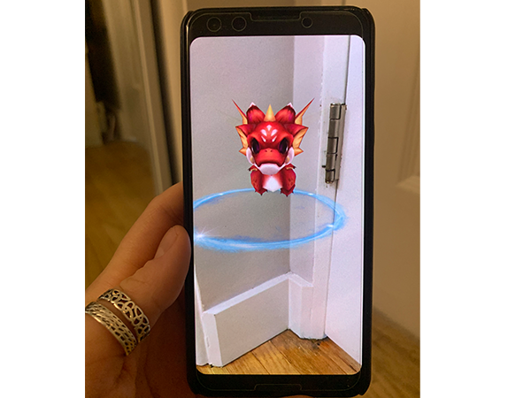

# AR_Pet

## Concept

   

AR Pet app for Android will provide users with a fun and interactive experince of placing an AR charcaterof their choice on top of the selected surfaces. The character is animated and can be rotated and reposition as well as its color and size. The app is simple and design to relax its user in the moment of stress. Pop up your AR pet companion on your screen wherever you are and have fun!

## Proof of concept
Once the app is runing the user is able to see a Magic Placement Ring on the device screen. Magic PLacment Rings detects horizontal surfaces and surves as a placemnet indicator for AR Pet 3D Model.  

   

When user is satisfied with the location of a Magic Placemnet Ring, he/she can tap on it and Animated AR Pet will appear at the centre of the placemnet indicator. 

### Development Tools and System Requirements for Android device
​
- Unity Engine
- AR Foundation 
- AR Core XR Plugin
- Android phone (See spesification below)
- (Minimum API Level: Android 7/API Level 24)

### Tasks
​
- Prepare the concept of the app and MVP
- Set up Android Device in Development Model
- Download/Add modules to the Unity version (Android SDK, NDK, Open JDK)
- Set up Ar project in GitHub, Name it, Clone repo, Start Project in Unity
- Download Package Mangers: AR Foundation, ARCore XR Plugin, ARKit XR Plugin (IOS)
- Set up Porject Settings, plug in the Android Device, Build and Run
- Import and optimize the 3D models.
​
	- animal pet
​
	- organize the Project browser (Assets)
- Start building the project according to MVP delivarables
​
​
### DeveloperExperience
​
As a technical artist and music/sound producer my experience is mainly concentrated in development of a level and sound designs for VR, AR application. I have experience in modeling, texturing, rigging and animating assets as well as creating a storyboarding and full level design for the experience. 

- Aibo Factory VR.
A virtual reality guided tutorial on how to assemble an iconic japanese robot dog called Aibo: first person game. 

- Checkers on the Console. 
An algorithm code design (C#)  for playing console based checkers board games.

		
